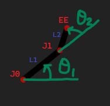
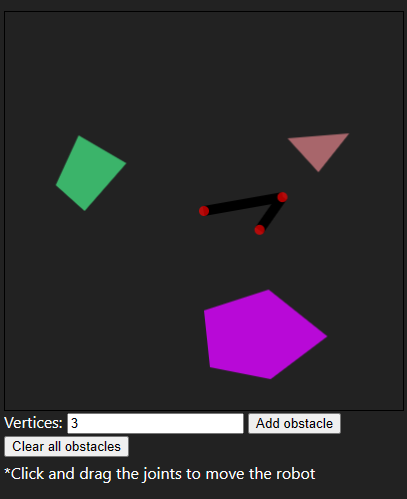
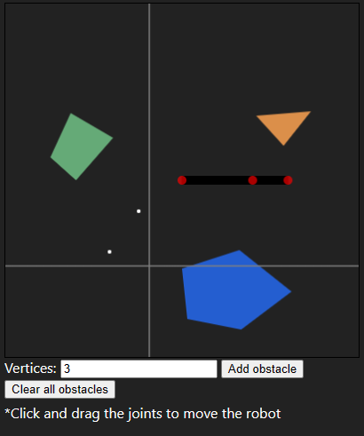
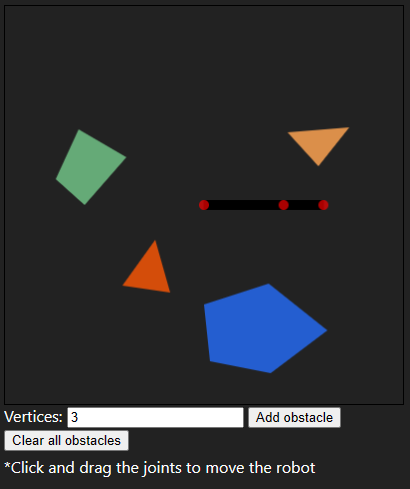
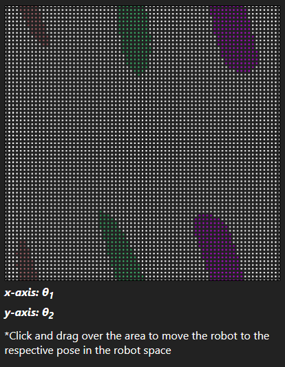
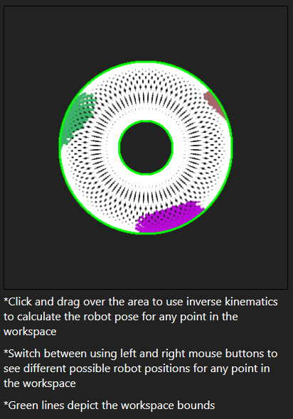
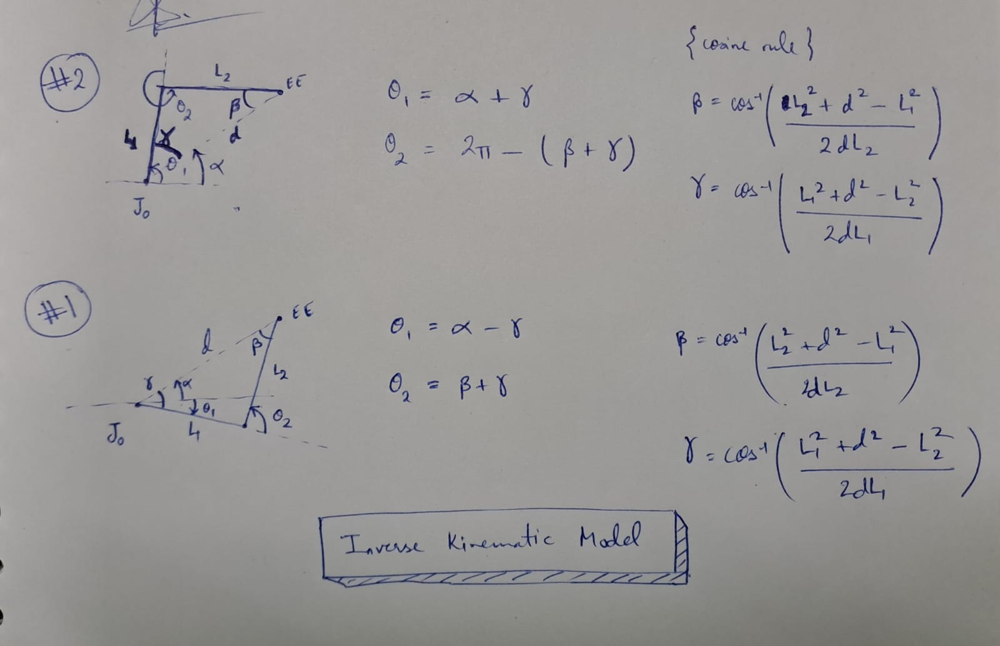
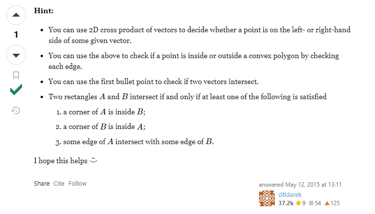

# About the project
A simple tool to visualise configuration space and workspace of a two-arm manipulator having two revolute joints, and an end effector at one end.

`J0` is a revolute joint, fixed in place at the center of the robot space, at coordinate (200, 200) from bottom left corner of the robot space. `J1` is also a revolute joint. The end effector is denoted as `EE`.

`L1` is a solid link of length 80 pixels and thickness 10 pixels while `L2` is 40 pixels long and 10 pixels thick.

The configuration of the manipulator is expressed using two angles - `θ1` and `θ2` - as shown in the figure:

>**Robot space** is the environment of the robot, including the robot, and all the obstacles around it.

>**Workspace** plots of the position of the end effector at any time. It also highlights the end effector positions for which an obstacle is colliding with the robot body.

>**Configuration space** plots the configuration variables `θ1` and `θ2` in a `θ1` vs `θ2` plane at any time.

# Features
## Animation: Play/Pause

Use this to make the robot manipulator move automatically from its current position through all its possible positions in 5 degree steps of `θ1` and `θ2`.

## Robot Space

You can click and drag `J1` or `EE` to move the robot manually.

### Adding obstacles

To add new polygonal obstacles to the scene:
1. Selecting the number of vertices from the input box.
2. Click `Add obstacle`.
3. Hover the mouse over the robot space and place the vertices.

4. Once you place all the vertices, the obstacle will appear in the robot space with a random color.

### Clearing all obstacles
You can click on `Clear all obstacles` to remove all the obstacles and reset all the other spaces.

## Configuration Space

You can click and drag over the configuration space to move the robot to the position corresponsing to the configuration at any point.

As the robot moves, its current configuration is plotted in the configuration space. Whenever a collision is detected at a configuration, the point plotted is colored the same as the obstacle that collided with the robot.

## Workspace

You can click and drag inside the bounded region (in green) to use inverse kinematics and move the robot manipulator to one of the IK solution positions.

For a two-arm manipulator, there are two IK solution sets for any given end effector position. You can switch between the two solution sets by switching between left and right mouse buttons while clicking and dragging.

# Implementation
## Inverse Kinematic (IK) Model

## Collision Detection Algorithm

Source: https://math.stackexchange.com/a/1278682